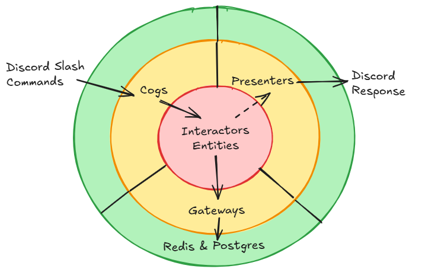

# FortuneTapper-Bot

This project is a Discord bot designed to manage Cosmere RPG characters. It includes features for importing character data from Demiplane and use it to make rolls.

## 🚀 Features

- Character Importing
- Dice rolling


## 🎯 Architecture

The project follows the clean (a.k.a. onion) architecture.




## 🛠️ Installation

1. **Clone the repository**:
```
git clone https://github.com/yourusername/your-repository.git
cd your-repository
```

2. **Set up the virtual environment**:
```
python -m venv venv
source venv/bin/activate
```

3. **Install dependencies**:
```
pip install -r requirements.txt
```

4. **Configure environment variables**:
Create a `.env` file and add the following:
```
DISCORD_TOKEN=your_discord_token
REDIS_URL=redis://localhost:6379/0
DATABASE_URL=any_db_that_supports_json_data
```


## 📂 Project Structure

```
.
├── adapter/
│   ├── config.py                # Repository configuration
│   ├── gateways/
│   │   ├── sqlalchemy_character.py  # SQLAlchemy models
│   │   ├── redis_character_repository.py  # Redis-based repository
│   │   ├── caching_character_repository.py  # Caching repository
├── domain/
│   ├── entities/
│   │   ├── character.py         # Character entity definitions
│   ├── interactors/
│   │   ├── import_character.py  # Character importing logic
├── cogs/
│   ├── character_cog.py         # Cog for character commands
├── tests/
│   ├── test_import_character.py # Tests for character importing
│   ├── test_sqlalchemy_repository.py  # Tests for SQLAlchemy
│   ├── test_redis_repository.py  # Tests for Redis
├── character_test.html          # Sample HTML for tests
├── main.py                      # Main bot file
└── README.md
```


## 🧑‍💻 Usage

### Running the Bot

1. **Start the bot**:
```
python bot.py
```

2. **Available Commands**:
   - **`/import`**: Imports a character from a Demiplane public URL.
   - **`/show`**: Displays the current character's sheet.
   - **`/roll`**

### Example Usage on Discord

1. Run the command:
```
/import https://example.com/character/12345
```

2. Display the character's data:
```
/show
```

---

## 🧪 Testing

Run unit tests with:
```
python -m unittest discover tests
```

---

## 🧰 Technologies

- **Discord Bot**: `discord.py`
- **Web Scraping**: `Playwright`, `lxml`
- **Databases**:
  - Relational: `SQLAlchemy`
  - Cache: `Redis`
- **Unit Testing**: `unittest`

---

## 📚 Contribution

1. Fork the project.
2. Create a branch for your feature (`git checkout -b feature/new-feature`).
3. Commit your changes (`git commit -m 'Add new feature'`).
4. Push your branch (`git push origin feature/new-feature`).
5. Open a Pull Request.

---

## ⚖️ License

This project is licensed under the [MIT License](https://opensource.org/licenses/MIT).

---

## 📝 Notes

- The `character_test.html` file is a sample used for testing. Ensure it contains valid data before running tests.
- Configure the bot's permissions on Discord to allow the defined commands to execute.
```