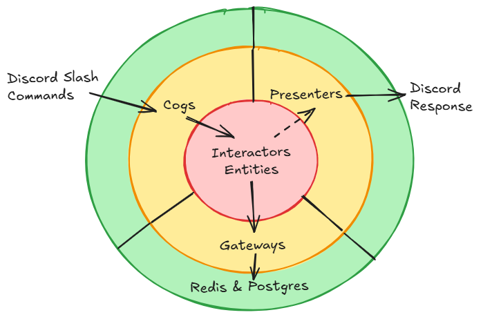
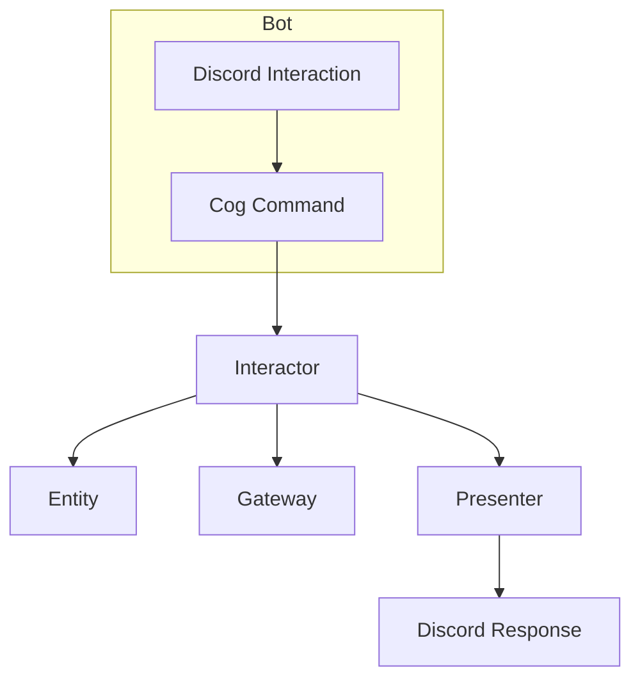

## 🎯 Architecture

The project follows the clean (a.k.a. onion) architecture.



The following diagram illustrates how commands interact with the architecture:



This flow ensures:
1. Commands are initiated in the cogs.
2. Business logic is handled in the interactors.
3. Responses are formatted in the presenters.


## 📂 Project Structure

```
.
├── adapter/
|   ├── cogs/                    
|   |   ├── character_cog.py          # Discord commands for character management: import, update, list, select
|   |   └── tap_cog.py                # Discord commands for roll management: roll, skill test, attack
│   ├── gateways/
|   |   └── character_repository/                   
|   |       ├── character_repository.py             # Character storage and persistence 
|   |       ├── caching_repository.py               # Caching logic of characters
|   |       ├── redis_character_repository.py       # In-memory storage of character
|   |       ├── sqlalchemy_character.py             # Character DAO
|   |       └── sqlalchemy_character_repository.py  # Database managing of characters
│   ├── presenters/
|   |   ├── character_presenter.py   # Embed messages for character sheet
|   |   └── roll_presenter.py        # Embed messages for rolls
│   └── config.py                    # Infrastructure configuration and initialization
├── domain/
│   ├── entities/
│   │   ├── character.py             # Character sheet classes
|   |   └── roll_result.py           # Roll result classes
│   └── interactors/
|       ├── exceptions.py            # Custom exceptions in interactions
│       ├── character_interactor.py  # Character managing logic
|       └── roll_interactor.py       # Roll managing logic
├── test/
├── bot.py                           # Main app file
├── requirements.txt                 # Python package requirements
└── Dockerfile                       # Facilitates deploy the bot
```


## 🛠️ Adding a New Command

Adding a new command to the FortuneTapper-Bot involves several steps to ensure it integrates seamlessly with the existing architecture. This guide outlines the process:

---

### **1. Create the Base Logic in the Interactors**
The interactors contain the core business logic for the bot. If your command requires specific logic, start by implementing it in an interactor.

1. Locate the appropriate file in `domain/interactors/` or create a new one if necessary.
2. Implement the logic. For example:
   ```python
   def custom_logic(param1: str, param2: int) -> CustomResult:
       # Your logic here
       return CustomResult(...)
   ```

3. Use entities, repositories, or utilities as needed within the interactor.

---

### **2. Create the Presentation in the Presenters**
If the command needs to send messages or embeds, add a method in a presenter located in `adapter/presenters/`.

1. Create or extend a file, e.g., `custom_presenter.py`.
2. Add methods to format the response:
   ```python
   import discord

   class CustomPresenter:
       def __init__(self, interaction: discord.Interaction):
           self.interaction = interaction

       async def show_custom_result(self, result: CustomResult):
           embed = discord.Embed(
               title="Custom Command Result",
               description=f"Result: {result.value}",
               color=discord.Color.blue()
           )
           await self.interaction.followup.send(embed=embed)
   ```

---

### **3. Implement the Command in the Cogs**
Commands are defined as methods inside classes extending `commands.Cog`.

1. Open or create a file in `adapter/cogs/`. If the command relates to a specific topic, place it in the relevant file (e.g., `tap_cog.py`).
2. Define the command using decorators from `discord.ext.commands`:
   ```python
   from discord.ext import commands
   from discord import app_commands

   class CustomCommand(commands.Cog):
       def __init__(self, bot):
           self.bot = bot

       @app_commands.command(name="custom", description="Description of the custom command")
       async def custom(self, interaction: discord.Interaction, param1: str, param2: int):
           try:
               result = custom_logic(param1, param2)  # Call the interactor
               await CustomPresenter(interaction).show_custom_result(result)  # Show the result
           except Exception as e:
               await interaction.followup.send("An error occurred.", ephemeral=True)
   ```

3. Register the Cog in the bot setup:
   ```python
   async def setup(bot):
       await bot.add_cog(CustomCommand(bot))
   ```

---

### **4. Add Unit Tests**
To ensure the command works as expected, add tests.

1. Create a test file in `test/adapter_test/`, e.g., `custom_cog_test.py`.
2. Use `unittest` to validate the command behavior:
   ```python
   import unittest
   from unittest.mock import AsyncMock, patch
   from adapter.cogs.custom_cog import CustomCommand

   class TestCustomCommand(unittest.IsolatedAsyncioTestCase):
       async def asyncSetUp(self):
           self.bot = AsyncMock()
           self.cog = CustomCommand(self.bot)

       @patch("domain.interactors.custom_logic")
       async def test_custom_command(self, mock_logic):
           mock_interaction = AsyncMock()
           mock_logic.return_value = CustomResult(value="Test")

           await self.cog.custom.callback(
               self.cog, mock_interaction, param1="test", param2=42
           )
           mock_logic.assert_called_once_with("test", 42)
           mock_interaction.followup.send.assert_called_once()
   ```

---

### **5. Document the Command**
Update the `docs/commands.md` file to document the new command for users:

```markdown
### /custom
**Description:** Description of the custom command.  
**Parameters:**
- `param1` (string): Description of the first parameter.
- `param2` (integer): Description of the second parameter.

**Example:**
```/custom test 42```
```